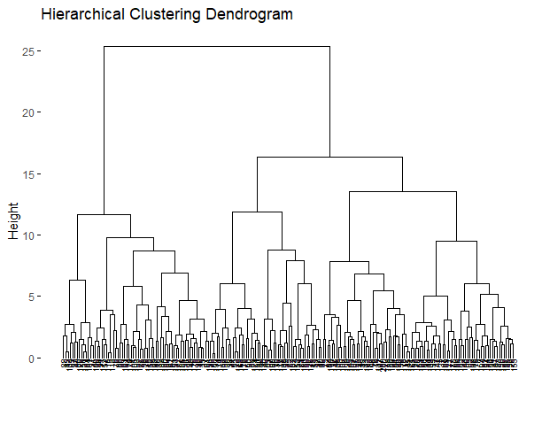
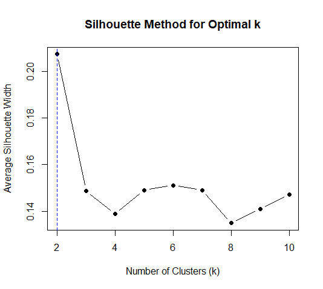
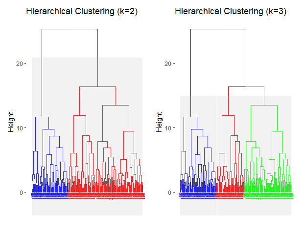
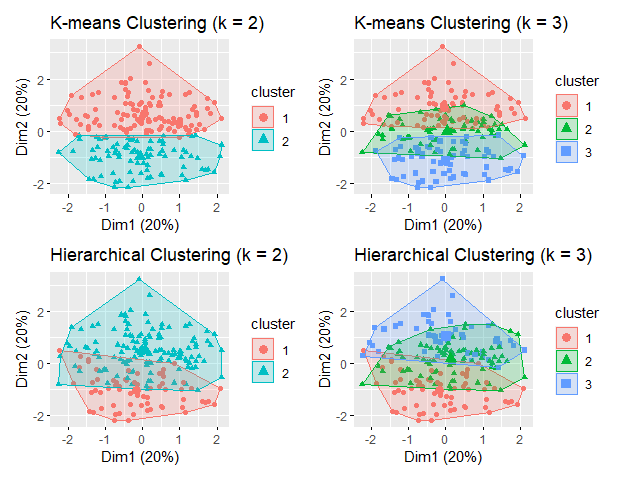
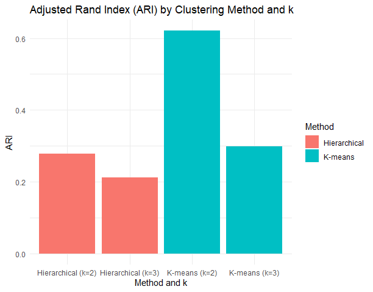
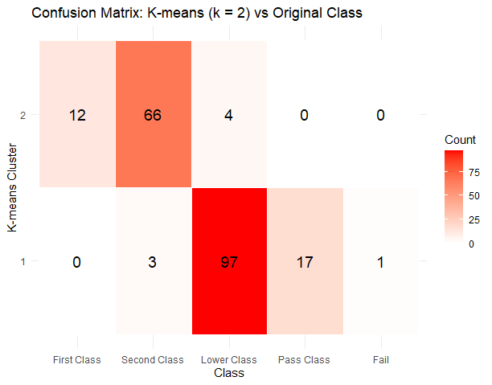

# Discovering Student Performance Patterns with K-means and Hierarchical 
## Abstract
This project investigates student performance data using unsupervised learning techniques to uncover meaningful patterns without relying on predefined labels. Principal Component Analysis (PCA) was applied to reduce dimensionality and retain the majority of variance in the dataset. Subsequently, K-means and hierarchical clustering were performed on the PCA-transformed features to group students with similar academic profiles. Multiple cluster evaluation methods, including the silhouette score, elbow method, and gap statistic, were used to determine optimal cluster numbers. The clustering results were assessed by comparing them with the original performance classes using the Adjusted Rand Index (ARI) and confusion matrix. Findings show that K-means clustering with k=2 provided the best alignment with the original labels, suggesting that unsupervised methods can effectively capture underlying performance structures and support data-driven educational analysis.
## Project objective
To identify meaningful performance patterns among students by applying unsupervised learning techniques on academic score data. This can support data-driven decision-making in educational evaluation and student profiling.
## Analysis workflow
### 1. Data overview and preparation
The dataset used in this study is downloaded from [Kaggle](https://www.kaggle.com/datasets/ntambaraetienne/students-dataset-for-graduation-classes-at-rp/data), created by Ntambara Etienne, and is provided under the [Apache License 2.0](https://www.apache.org/licenses/LICENSE-2.0) The working dataset used in this project (student_results.xlsx) is a local copy saved from the original Kaggle file to ensure safe access and reproducibility.

This dataset contains 200 observations and 10 variables, including students'ID, total score, percentage score, class label, and scores from 5 academic subjects. The variables are mostly numeric, with the exception of the Class variable, which is categorical and represents the final performance levele of the student (e.g.m "First Class", "Second Class", "Lower Class", "Pass Class", "Fail"). There are no missing values in the dataset.
### 2. Feature selection and scaling
Selected 6 subject scores, along with the total score and percentage variables. All chosen features were standardized using z-score normalization to ensure comparability acrossdifferent scales.

Table 1. Statistical analysis of selected features
|Machine_learning | Data_mining  |Cyber_security |Software_engineering |Research_methodology |  Blockchain | Total_Score  |  Percentage  |
|:----------------|:-------------|:--------------|:--------------------|:--------------------|:------------|:-------------|:-------------|
|Min.   :40.00    |Min.   :35.00 |Min.   :30.00  |Min.   :45.00        |Min.   :50.00        |Min.   :38.0 |Min.   :281.0 |Min.   :46.83 |
|1st Qu.:54.00    |1st Qu.:52.75 |1st Qu.:47.75  |1st Qu.:57.75        |1st Qu.:62.00        |1st Qu.:50.0 |1st Qu.:385.8 |1st Qu.:64.29 |
|Median :68.50    |Median :67.00 |Median :62.00  |Median :72.00        |Median :73.00        |Median :67.5 |Median :409.5 |Median :68.25 |
|Mean   :69.33    |Mean   :67.70 |Mean   :62.92  |Mean   :71.99        |Mean   :73.05        |Mean   :66.5 |Mean   :411.5 |Mean   :68.58 |
|3rd Qu.:83.00    |3rd Qu.:86.00 |3rd Qu.:79.25  |3rd Qu.:86.00        |3rd Qu.:84.25        |3rd Qu.:81.0 |3rd Qu.:441.2 |3rd Qu.:73.54 |
|Max.   :99.00    |Max.   :97.00 |Max.   :94.00  |Max.   :99.00        |Max.   :96.00        |Max.   :98.0 |Max.   :502.0 |Max.   :83.67 |
### 3. Principal component analysis (PCA)
Principal Component Analysis (PCA) was applied to the standardized dataset to reduce dimensionality and mitigate potential multicollinearity among features. Figure 1 shows the cumulative explained variance as the number of components increases. The first five components together account for approximately 90% of the total variance, and were therefore retained for clustering analysis. Figure 2 presents a scatter plot of the first two principal components, which explain 53.2% of the total variance. While clear group separation is not immediately evident, the distribution of points reveals meaningful variation in student performance, offering a useful basis for clustering.

Figure 1. Cumulative explained variance by PCA components

Figure 2. Scattor plot for the first and second PCA

### 4. Clustering methods
#### 4.1. K-meansing clustering
K-means clustering was applied on the first five principal components retained from the PCA. To determine the optimal number of clusters, three different methods were evaluated: the silhouette method, the elbow method (WSS), and the gap statistic. As shown in Figures 3–5, both the silhouette and elbow methods suggested that k=2 was the optimal number of clusters, while the gap statistic slightly favored k=1, which was not practical for clustering. Therefore, k=2 and k=3 were both examined in the subsequent analysis. Figure 6 visualizes the clustering results under these two values of k.

Figure 3. Optimal number of clusters by Silhouette method (K-means)

Figure 4. Optimal number of clusters by Elbow method (K-means)

Figure 5. Optimal number of clusters by Gap Statistic (K-means)

Figure 6. K-means clustering results for k=2 and k=3

#### 4.2 Hierarchical clustering 
Hierarchical clustering was performed using Ward’s method with Euclidean distance. As shown in Figure 7, the dendrogram provides an overview of the hierarchical structure of the data. The silhouette method (Figure 8) suggested that the optimal number of clusters is 2, while the gap statistic preferred only 1 cluster. Despite this discrepancy, we proceeded to evaluate both 2 and 3 cluster solutions. Figure 9 presents the clustering results for k=2 and k=3, offering visual insight into the grouping patterns formed under each setting.

Figure 7. Hierarchical clustering dendrogram

Figure 8. Optimal number of clusters by Silhoouette method (Hierarchical)

Figure 9. Hierarchical clustering results for k=2 and k=3

### 5. Evaluation and comparison
Figure 10 presents a visual comparison of the clustering results using both K-means and Hierarchical clustering methods with k=2 and k=3. All plots are projected onto the first two principal components, which together capture a substantial proportion of the data variance. When k=2, K-means clustering exhibits a more distinct separation between groups compared to Hierarchical clustering. However, introducing k=3 reveals more nuanced structure in both methods. These visualizations provide an intuitive sense of how different clustering techniques and choices of k affect group formation in the reduced feature space.

Figure 10. Clustering methods for k=2 and k=3

#### 5.1 Adjusted Rand Index (ARI)
The Adjusted Rand Index (ARI) was computed by comparing the clustering labels with the original class labels to quantitativelty evaluate the clustering performance. In Figure 11, K-means clustering with k=2 achieved the highest ARI score (0.62), indicating the strongest alignment with the predefined class labels. This supports our earlier visual observation that the K-means (k=2) model provides the most interpretable separation. In contrast, both hierarchical clustering models and K-means with k=3 yielded lower ARI scores, suggesting less agreement with the actual classification structure.

Figure 11. ARI comparision across methods and cluster numbers

#### 5.2 Cluster vs class label matching
Based on the ARI comparison in the previous section, K-means clustering with k=2 was selected for further comparison with the original class labels, as it achieved the highest alignment. The confusion matrix in Figure 12 demonstrates how the clusters obtained from K-means clustering with k=2 align with the original student performance classes. It is evident that Cluster 1 predominantly includes students labeled as Lower Class and Pass Class, while Cluster 2 mostly corresponds to Second Class and First Class students. Although not a perfect match, the clustering structure captures the general distinction between higher-performing and lower-performing students. This confirms that the clustering based on academic performance variables is consistent with the predefined class labels and supports the validity of the clustering results.

Figure 12. Confusion matrix: K-means (k=2) vs. Orignal class label

### 6. Conclusion
In this project, we explored student performance data using unsupervised learning techniques, including PCA, K-means clustering, and hierarchical clustering. PCA helped reduce dimensionality while preserving most of the variance in the dataset. Clustering analysis was conducted using both K-means and hierarchical methods with different values of k. The evaluation results, particularly the ARI, showed that K-means clustering with k=2 provided the best alignment with the original class labels. This indicates that even without supervision, the clustering algorithm was able to reveal meaningful patterns that correspond well to the predefined student performance categories. The findings support the potential of clustering techniques in educational data mining to uncover performance structures and assist in academic profiling.

