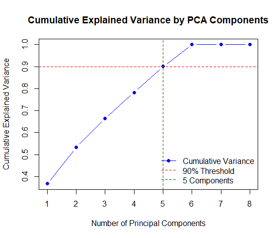
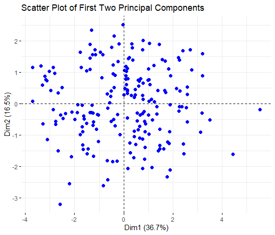
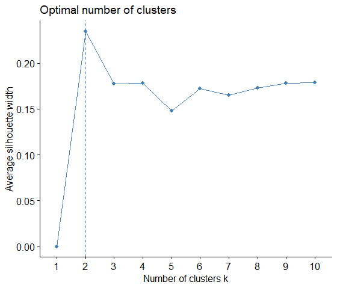
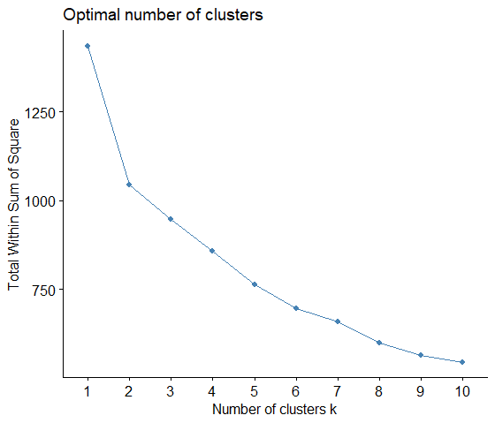
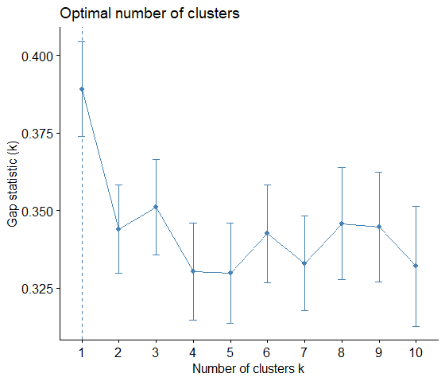
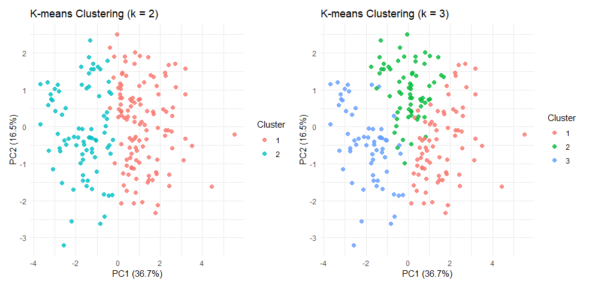

# Discovering Student Performance Patterns with K-means and Hierarchical 
## Abstract
xx
## Analysis workflow
### 1. Data overview and preparation
The dataset used in this study is downloaded from [Kaggle](https://www.kaggle.com/datasets/ntambaraetienne/students-dataset-for-graduation-classes-at-rp/data), created by Ntambara Etienne, and is provided under the [Apache License 2.0](https://www.apache.org/licenses/LICENSE-2.0)
This dataset contains 200 observations and 10 variables, including students'ID, total score, percentage score, class label, and scores from 5 academic subjects. The variables are mostly numeric, with the exception of the Class variable, which is categorical and represents the final performance levele of the student (e.g.m "First Class", "Second Class", "Lower Class", "Pass Class", "Fail"). There are no missing values in the dataset.
### 2. Feature selection and scaling
For the purpose of clustering analysis, author selected 6 subject scores, along with the total score and percentage variables. All chosen features were standardized using z-score normalization to ensure comparability acrossdifferent scales.

Table 1. Statistical analysis of selected features
|Machine_learning | Data_mining  |Cyber_security |Software_engineering |Research_methodology |  Blockchain | Total_Score  |  Percentage  |
|:----------------|:-------------|:--------------|:--------------------|:--------------------|:------------|:-------------|:-------------|
|Min.   :40.00    |Min.   :35.00 |Min.   :30.00  |Min.   :45.00        |Min.   :50.00        |Min.   :38.0 |Min.   :281.0 |Min.   :46.83 |
|1st Qu.:54.00    |1st Qu.:52.75 |1st Qu.:47.75  |1st Qu.:57.75        |1st Qu.:62.00        |1st Qu.:50.0 |1st Qu.:385.8 |1st Qu.:64.29 |
|Median :68.50    |Median :67.00 |Median :62.00  |Median :72.00        |Median :73.00        |Median :67.5 |Median :409.5 |Median :68.25 |
|Mean   :69.33    |Mean   :67.70 |Mean   :62.92  |Mean   :71.99        |Mean   :73.05        |Mean   :66.5 |Mean   :411.5 |Mean   :68.58 |
|3rd Qu.:83.00    |3rd Qu.:86.00 |3rd Qu.:79.25  |3rd Qu.:86.00        |3rd Qu.:84.25        |3rd Qu.:81.0 |3rd Qu.:441.2 |3rd Qu.:73.54 |
|Max.   :99.00    |Max.   :97.00 |Max.   :94.00  |Max.   :99.00        |Max.   :96.00        |Max.   :98.0 |Max.   :502.0 |Max.   :83.67 |
### 3. Principal component analysis (PCA)
Principal Component Analysis (PCA) was applied to the standardized dataset to reduce dimensionality and mitigate potential multicollinearity among features. The cumulative explained variance plot (Figure 1) showed how much variance was retained as the number of components increased. The first five principal components together explained approximately 90% of the total variance in the data, so they were retained for the subsequent clustering analysis. Figure 2 presented a scatter plot of the first two principal components, which together explained approximately 53.2% of the total variance. The plot illustrated how students were distributed in the reduced feature space. Although no clear separation between groups was observed, some directional patterns and variability in student performance could be visually identified, providing a useful basis for clustering.

Figure 1. Cumulative explained variance by PCA components

Figure 2. Scattor plot for the first and second PCA

### 4. Clustering methods
#### 4.1. K-meansing clustering
K-means clustering was applied on the first five principal components retained from the PCA. To determine the optimal number of clusters, three different methods were evaluated: the silhouette method, the elbow method (WSS), and the gap statistic. As shown in Figures 3–5, both the silhouette and elbow methods suggested that k=2 was the optimal number of clusters, while the gap statistic slightly favored k=1, which was not practical for clustering. Therefore, k=2 and k=3 were both examined in the subsequent analysis. Figure 6 visualizes the clustering results under these two values of k.

Figure 3. Optimal number of clusters by Silhouette method (K-means)

Figure 4. Optimal number of clusters by Elbow method (K-means)

Figure 5. Optimal number of clusters by Gap Statistic (K-means)

Figure 6. K-means clustering results for k=2 and k=3

#### 4.2 Hierarchical clustering 

Figure 6. K-means clustering results for k=2 and k=3

### 5. Evaluation and comparison

#### 5.1 Cluster vs class label matching
#### 5.2 Adjusted Rand Index (ARI)

### 6. Conclusion

### Data Source and License

